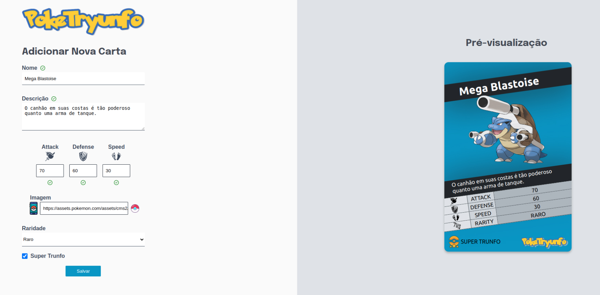

## Projeto Tryunfo | Módulo de Desenvolvimento Front-End da Trybe.

Neste projeto a pessoa usuária deve ser capaz de criar suas próprias cartas, visualizar através de um Preview como elá ficará e também ser capaz de utilizar filtros para localizar a carta desejada.

Tecnologias Utilizadas: React, CSS, JSX.
